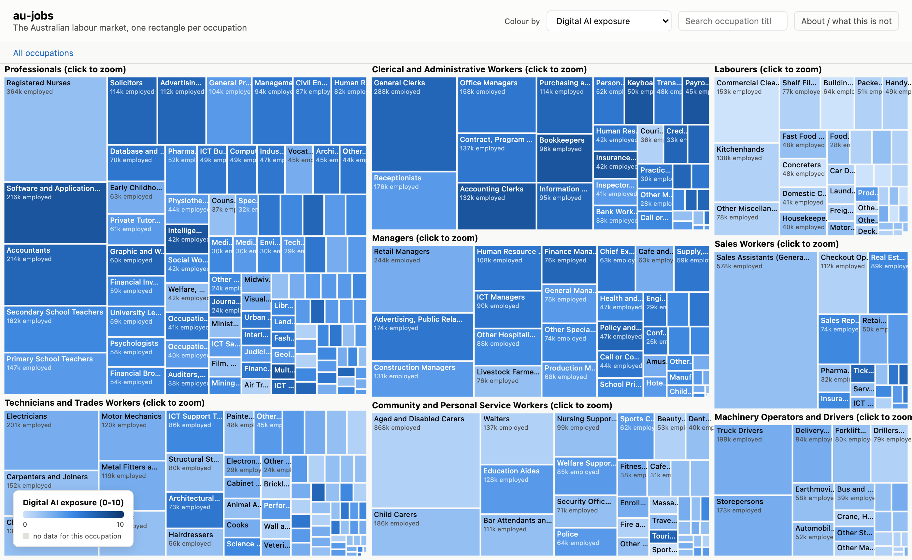
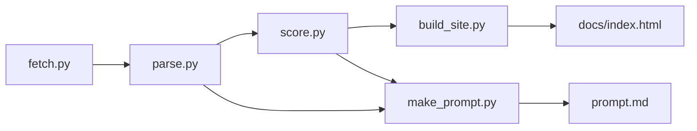

# au-jobs

The Australian labour market as one picture: every occupation is a rectangle, sized by
how many people do it, coloured by whichever question you want to ask of the data.



*Employment from the February 2026 quarter, coloured by the digital AI exposure layer. Darker means more of the day-to-day work overlaps with what current AI tools already do; it says nothing about headcount.*



## The idea

Australia has roughly 360 occupations at the ANZSCO 4-digit "unit group" level, from
Chief Executives down to Vending Machine Attendants. Government agencies publish real
numbers against every one of them: how many people do it, what it pays, whether it is
projected to grow, whether it is in national short supply. Nobody puts all of that on
one screen. This repo does: a treemap where area is employment and colour is a toggle
between earnings, growth, shortage, and one more thing.

The one more thing is the interesting part. A large language model reads each
occupation's title and scores it 0 to 10 for "digital AI exposure": how much of the
day-to-day work overlaps with what current AI tools (language models, coding
assistants, image and video generation, agentic tools) are already good at. That score
is not a forecast of who loses their job. Software developers score high on this scale
while demand for the role can still grow: the score measures task overlap, not headcount.
The rubric prompt that produces it lives in one markdown file
(`prompts/ai-exposure.md`), so you can replace the question entirely (humanoid robotics
exposure, offshoring exposure, climate transition exposure, whatever you want to ask)
and rerun one script to recolour the whole map.

This is not a report and not a forecast. It is a working reference implementation: real
public data, a real pipeline, and a scoring layer you can point at any question you can
write a rubric for. Read "What AI exposure is NOT" below before you draw conclusions
from the colours.

## What happens when you run it

1. **Fetch.** `fetch.py` downloads five xlsx files from abs.gov.au and
   jobsandskills.gov.au into `data/raw/` (gitignored). Idempotent: reruns skip files
   already on disk.
2. **Parse.** `parse.py` reads those five files and merges them into one row per
   occupation in `data/occupations.csv`, plus `data/parse-report.md` with the exact
   coverage counts for that run.
3. **Score.** `score.py` batches occupations (about 18 at a time) into a prompt built
   from `prompts/ai-exposure.md`, asks a model for a JSON array of scores and
   rationales, and caches the result per occupation in `data/scores.json`. Safe to
   interrupt and rerun: only uncached occupations get scored again.
4. **Build.** `build_site.py` merges the CSV and the score cache into
   `docs/data.json`, the one file the browser fetches.
5. **Serve.** `make serve` starts a local server over `docs/`; open it and the treemap
   loads `data.json` and draws itself. `make_prompt.py` bundles the same data into
   `prompt.md`, one line per occupation, for pasting into a chat with any model.

## Quick start

Prerequisites: [uv](https://docs.astral.sh/uv/), Python 3.12 (uv installs it if you
don't have it), and either an Anthropic API key or a local
[Claude Code](https://claude.com/claude-code) install for the scoring step.

```
git clone https://github.com/Jiplet/au-jobs.git
cd au-jobs
uv sync

uv run python fetch.py
uv run python parse.py

# no API key? if you have Claude Code installed, this uses your subscription instead
uv run python score.py --backend claude-cli

uv run python build_site.py
uv run python make_prompt.py

make serve
```

Open `http://localhost:8000`. You should see a treemap of the whole labour market,
coloured by AI exposure by default, with a dropdown to switch to earnings, growth, or
skills shortage. Hover a rectangle for the numbers; click a major group (or any tile
inside one) to zoom into it; the search box dims everything that doesn't match.

If you have an Anthropic API key instead of (or as well as) Claude Code, copy
`.env.example` to `.env`, fill in `ANTHROPIC_API_KEY`, and run
`uv run python score.py` (the `anthropic` backend is the default). It tracks real spend
against a hard USD cap (`--usd-cap`, default 2.00) computed from actual token usage, and
stops before going over.

Dry run, no API or CLI calls, just prints the first two assembled prompts:

```
uv run python score.py --dry-run
```

Run the tests:

```
uv run pytest -q
```

Run the whole pipeline in one go:

```
make all
```

### Publishing your own copy on GitHub Pages

Fork the repo, then in your fork: **Settings -> Pages -> Build and deployment -> Deploy
from a branch -> branch `main`, folder `/docs`**. Your live map is at
`https://<your-username>.github.io/au-jobs/` a minute or two later. `docs/` uses only
relative paths and a vendored copy of D3, so it works with no build step and no CDN.

## What's here

| Path | What it is | When you touch it |
|---|---|---|
| `fetch.py` | Downloads the raw ABS/JSA xlsx files | Adding a new source |
| `parse.py` | Merges raw files into `data/occupations.csv` | A source changes shape |
| `score.py` | Batches occupations to an LLM, caches scores | Changing the scoring logic itself |
| `prompts/ai-exposure.md` | The scoring rubric | Asking a different question of the data |
| `build_site.py` | Merges CSV + scores into `docs/data.json` | Changing what the site can show |
| `make_prompt.py` | Bundles everything into `prompt.md` | Changing what goes in the LLM bundle |
| `docs/` | The static site (GitHub Pages root) | Changing the map itself |
| `sources.yaml` | Every URL, release date, licence | A source moves or a new release drops |
| `data/` | Generated CSV, score cache, provenance notes | Never by hand, always via the scripts |
| `tests/` | Fixture-based tests for the three parsers | Changing any parsing or scoring logic |
| `Makefile` | One target per pipeline stage | Rarely |

## Adapting it to your setup

The one file you are actually meant to edit is `prompts/ai-exposure.md`. It is plain
markdown: a question, a 0-10 scale with anchor examples, and a "what this is NOT"
section. Swap the question, keep the JSON output contract at the bottom (an array of
`{code, score, rationale}`), rerun `uv run python score.py --backend claude-cli`, then
`uv run python build_site.py`. The dropdown label on the map is hardcoded in
`docs/index.html` as "Digital AI exposure" - change that string too if you change the
question.

To point this at a different country's occupation classification (ISCO, SOC), you would
rewrite `parse.py`'s five loader functions against your own sources and keep everything
downstream (`score.py`, `build_site.py`, the site) unchanged, since they only care about
the `data/occupations.csv` schema, not where the numbers came from.

## Design notes

**Why a treemap.** Bar charts do not scale to 360 categories and a scatter plot buries
the "how many people does this actually affect" question. Area-for-magnitude is the one
encoding that makes Sales Assistants (a huge rectangle) and Legislators (a sliver)
honestly comparable at a glance.

**Why score from titles when task text is not there.** The honest answer is the task
text is not there: neither ABS nor JSA publish it in bulk (see `data/README.md`). Asking
the model to infer likely tasks from the title and major group before scoring, and
saying so on the "about" panel, was the choice over quietly scoring titles alone and
letting a reader assume the model saw a real task list.

**Two scoring backends, and why.** The scoring step was built to call the Anthropic API
directly (`--backend anthropic`, the default), with a hard USD cap computed from real
token usage. During this build the workspace's Anthropic and OpenAI API keys both had no
usable credit, so the live scoring run for all ~360 occupations used
`--backend claude-cli` instead: it shells out to the Claude Code CLI
(`claude -p "<prompt>" --model haiku --output-format text`), billed against a Claude Code
subscription rather than metered API credit, no key required. It runs with
`--setting-sources ""` and its working directory set to a neutral temp folder, so it
scores from the rubric alone and never picks up the operator's own CLAUDE.md. The
anthropic backend's cap logic is exercised in `tests/test_score_parse.py` with a fake
client rather than a real API call, since there was no live credit to test it against.
If you have API credit, `--backend anthropic` is the one to use for its explicit spend
accounting; `--backend claude-cli` is there for exactly the situation this build hit.

**Batching, not one call per occupation.** Sending 18 occupations per call instead of
one keeps the rubric text (which is most of the prompt) from being re-sent 360 times,
and turns roughly 360 calls into about 21. Each batch is parsed tolerantly (models wrap
JSON in a markdown fence more often than you'd think), validated (every requested code
must come back with a score 0-10), and retried once before being skipped and logged.
Scores are cached per occupation code in `data/scores.json`, so a batch failure loses at
most 18 scores, not the whole run, and a rerun only re-scores what is missing.

**A real gotcha from building this.** The JSA employment projections sheet puts the
5-year and 10-year percentage-change columns two columns to the right of the
level-change columns (`'000` people, not per cent). An early version of `parse.py` read
the level-change columns by mistake and produced "6.8%" growth for Chief Executives
that actually printed as "419%" once mislabelled as a percentage. `tests/test_parse.py`
now asserts the exact column index deliberately, with a comment explaining why, so this
does not silently regress if the source file's layout shifts.

**Colour ramps.** The sequential (single-hue blue) and diverging (blue to red through a
neutral grey) scales are a validated colourblind-safe default rather than a hand-picked
palette, used unchanged, so no separate validation pass was needed for this build.

**What the data actually showed.** Of the 35 occupations with more than 100,000 people
employed, seven scored 7 or higher on AI exposure: Software and Applications Programmers
(216k, score 8), General Clerks (288k, score 7), Accountants (214k, score 7), Accounting
Clerks (132k, score 8), Solicitors (114k, score 7), Purchasing and Supply Logistics
Clerks (114k, score 7), and Advertising and Marketing Professionals (112k, score 7).
General Clerks and Accounting Clerks scoring as high as Software Developers was not
obvious going in: on the treemap, the big rectangles that turn dark blue when you switch
to the AI exposure layer are not all "tech jobs," they are wherever the daily work is
mostly reading, writing, and processing structured information at a desk, clerical roles
included.

## Limitations and non-goals

- **Single-pass LLM scoring, one model, no inter-rater check.** Treat scores as a
  starting point for a question, not a finding. Rerun with a different model or several
  runs averaged if you need something sturdier.
- **Vintage mismatches across sources.** The ABS ANZSCO 2022 structure file, EQ08, the
  earnings cube, and the two JSA files are not all published on the same classification
  or survey vintage. Coverage gaps in `data/parse-report.md` are mostly this, not missing
  effort.
- **One snapshot in time.** EQ08 actually has quarterly data back to 1986; this build
  only uses the latest quarter. There is no time-series view in the map.
- **Not built for a phone.** 360 rectangles need a reasonably large screen to stay
  readable; the map still loads and responds on mobile, but small tiles get hard to
  read.
- **This is not policy advice, and it does not model who is protected from AI exposure
  by regulation, licensing, or plain human preference for dealing with a person.** See
  "What AI exposure is NOT" below, in full.

## What AI exposure is NOT

- **Not a job-loss or unemployment forecast.** A high score does not mean the job goes
  away. Software developers score high on task exposure; whether demand for that role
  grows, shrinks, or holds steady is a separate question this project does not model.
- **Not demand elasticity.** Cheaper delivery can increase total demand for a kind of
  work (induced demand) as easily as it can shrink headcount. Not modelled here.
- **Not regulation or credentialing.** A licence, safety regulation, or professional
  body that currently requires a human is real and durable, and is not part of the
  score.
- **Not a preference for human contact.** Whether people want a human regardless of what
  a machine can technically do (a GP consultation, a hairdresser) is not part of the
  score.
- **Not an all-or-nothing automation switch.** Almost no occupation gets fully replaced
  task by task. The score is an estimate of how much a typical week's mix of tasks
  shifts, not a count of tasks eliminated.

Full rubric with the 0-10 anchors: `prompts/ai-exposure.md`.

## FAQ

**Why ANZSCO 4-digit unit groups and not the full 6-digit occupation list?** It is the
finest level at which ABS publishes employment, and matches what JSA's shortage list and
projections both use natively (JSA also pre-aggregates a 6-digit list up to 4-digit for
exactly this reason).

**Can I trust a specific AI exposure score?** Read its rationale (the map shows it in
the tooltip) before trusting the number alone. It is one model's estimate from a title
and inferred tasks, not ground truth.

**Why is "average weekly earnings" not "median"?** ABS does not publish a median at this
occupation grain, only a mean. See `data/README.md` for the full explanation; the CSV
column is named `avg_weekly_earnings`, deliberately not `median_weekly_earnings`.

**The employment numbers do not match the headline unemployment rate I saw in the news.**
Different question. This dataset is employed persons by occupation, one quarter, not the
unemployment rate, and it does not include people who are unemployed or not in the
labour force at all.

**Can I score something other than AI exposure?** Yes, that is the point. Edit
`prompts/ai-exposure.md` (or copy it to a new file and point `score.py`'s
`RUBRIC_PATH` at it) and rerun.

## Licence

MIT. See `LICENSE`. Data is Australian Bureau of Statistics and Jobs and Skills
Australia material, used under CC BY 4.0: see `data/README.md` for the required
attribution line and `sources.yaml` for exact sources.
